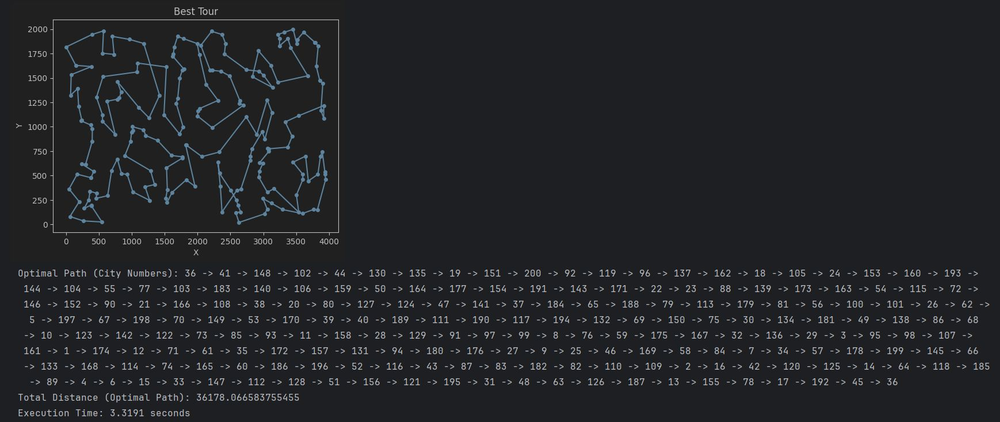
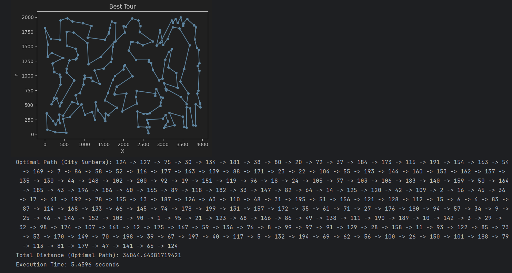
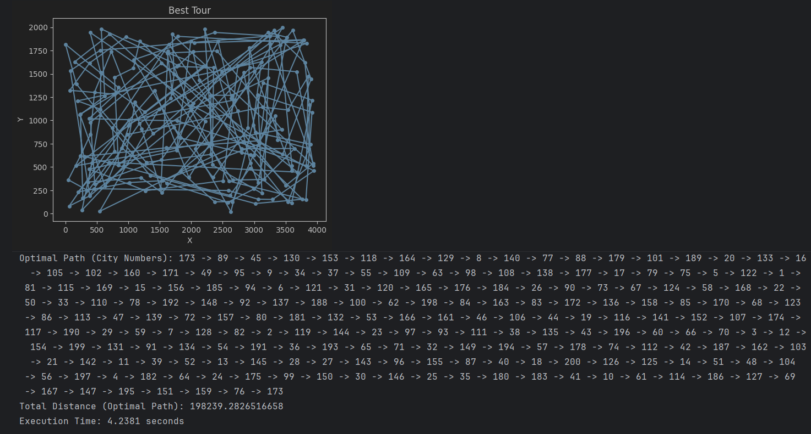

# Simulated Annealing Variants for the Traveling Salesman Problem (TSP)

## Overview

This project implements several variants of **Simulated Annealing (SA)** to solve the **Traveling Salesman Problem (TSP)** using the standard **TSPLIB** dataset `kroB200`.

The implementations range from a **classical stochastic Simulated Annealing** algorithm to **partially and fully deterministic variants**, allowing a structured comparison of randomness, exploration capability, and convergence behavior.

---

## Dataset

* **Dataset:** `kroB200`
* **Problem Type:** Traveling Salesman Problem (TSP)
* **Number of Cities:** 200
* **Coordinates:** 2D Euclidean
* **Distance Metric:** Euclidean distance
* **Tour Type:** Closed tour (returns to starting city)

Each city is represented by an ID and its `(x, y)` coordinates. A solution is a permutation of all cities forming a Hamiltonian cycle.

---

## Core Components

### Distance Evaluation

The objective function computes the total length of a tour by summing Euclidean distances between consecutive cities, including the return from the last city to the first.

### Neighborhood Operator

All implementations use the **2-opt neighborhood**, where a segment of the tour between indices `(i, j)` is reversed to generate a neighboring solution.

---

## 1. Classical Simulated Annealing (Stochastic SA)

### Imported Libraries

```python
import math
import random
import matplotlib.pyplot as plt
import time
```

* `math`: Used for square root and exponential calculations
* `random`: Used for generating random initial solutions and neighbor moves
* `matplotlib.pyplot`: Used to visualize the final TSP tour
* `time`: Used to measure execution time

---

### `load_dataset(file_path)`

```python
def load_dataset(file_path):
```

* Reads a **TSPLIB-formatted TSP dataset**
* Skips the header lines and parses city coordinates
* Each city is stored as a tuple: `(city_id, x, y)`
* Returns a list of all cities

Purpose: Load and store city coordinates for distance computation.

---

### `euclidean_distance(city1, city2)`

```python
def euclidean_distance(city1, city2):
```

* Computes the **Euclidean distance** between two cities using their coordinates
* Uses the standard distance formula:
  [
  \sqrt{(x_1-x_2)^2 + (y_1-y_2)^2}
  ]

Purpose: Compute the distance between two cities in 2D space.

---

### `total_distance(cities, tour)`

```python
def total_distance(cities, tour):
```

* Calculates the **total length of a TSP tour**
* Sums distances between consecutive cities in the tour
* Adds the distance from the last city back to the first to form a closed loop

Inputs:

* `cities`: list of city coordinates
* `tour`: permutation of city indices

Purpose: Evaluate the quality (cost) of a candidate solution.

---

### `two_opt_swap(tour, i, j)`

```python
def two_opt_swap(tour, i, j):
```

* Implements the **2-opt neighborhood operator**
* Reverses the segment of the tour between indices `i` and `j`
* Produces a new neighboring tour

Purpose: Generate a neighboring solution for local search.

---

### `simulated_annealing(...)`

```python
def simulated_annealing(cities, initial_temp, cooling_rate, stopping_temp, max_iter):
```

This function implements the **classical Simulated Annealing algorithm**.

#### Key Steps:

1. **Initialization**

   * Creates a random initial tour
   * Computes its total distance
   * Initializes the best solution found

2. **Main Loop**
   Runs until:

   * Temperature falls below `stopping_temp`, or
   * Maximum iterations are reached

3. **Neighbor Generation**

   * Randomly selects two indices `(i, j)`
   * Applies `two_opt_swap` to generate a new tour

4. **Acceptance Decision**

   * Computes:

     ```
     delta = new_distance - current_distance
     ```
   * Accepts the new solution if:

     * It is better (`delta < 0`), or
     * With probability `exp(-delta / temperature)` if worse

5. **Cooling**

   * Temperature is reduced exponentially:

     ```
     temperature *= cooling_rate
     ```

6. **Best Solution Update**

   * Tracks the best tour encountered during the search

Purpose: Search for a near-optimal TSP tour using probabilistic hill-climbing.

---

### `plot(cities, tour)`

```python
def plot(cities, tour):
```

* Visualizes the final TSP tour
* Plots city coordinates and connecting edges
* Displays the tour as a closed loop
* Prints:

  * City visit order
  * Total tour distance

Purpose: Provide visual and textual representation of the final solution.

---

### Main Execution Block

```python
start_time = time.time()
cities = load_dataset("kroB200.txt")
best_tour, best_distance = simulated_annealing(cities)
plot(cities, best_tour)
end_time = time.time()
```

### Output:


* Loads the dataset
* Runs the Simulated Annealing algorithm
* Visualizes the best tour
* Measures and prints execution time

Purpose: Execute the full workflow from data loading to result visualization.


---

## 2. Deterministic Initial Tour

### Description

This variant removes randomness from the **initial solution**.

### Characteristics

* **Initial Tour:** Fixed ordered tour `[0, 1, 2, ..., n-1]`
* **Neighbor Selection:** Random
* **Acceptance Rule:** Standard SA probabilistic acceptance

### Purpose

To isolate and study the impact of a deterministic starting point on convergence and final solution quality.

### Output:


---

## 3. Deterministic City Selection

### Description

This variant removes randomness from the **neighbor selection process**.

### Characteristics

* **Initial Tour:** Random
* **Neighbor Selection:** Deterministic

  ```
  i = iteration % (n - 1)
  j = i + 1
  ```
* **Acceptance Rule:** Standard SA

### Purpose

To analyze how systematic neighborhood traversal affects exploration and performance.

### Output:


---

## 4. Deterministic Acceptance (Greedy SA)

### Description

This variant removes stochasticity from the **acceptance mechanism**.

### Characteristics

* **Initial Tour:** Random
* **Neighbor Selection:** Random
* **Acceptance Rule:**

  * Only strictly improving solutions are accepted
  * Worse solutions are always rejected

### Interpretation

This effectively converts Simulated Annealing into a **greedy local search** algorithm using 2-opt moves.

### Output:


---

## 5. Fully Deterministic Simulated Annealing

### Description

This is the most restrictive variant, where **all sources of randomness are removed**.

### Characteristics

* **Initial Tour:** Deterministic
* **Neighbor Selection:** Deterministic
* **Acceptance Rule:** Greedy (only better solutions accepted)
* **Cooling Schedule:** Retained but has no effect on acceptance

### Interpretation

Despite the name, this algorithm behaves as a **deterministic 2-opt local search**, useful for direct comparison with stochastic SA.

### output:


---

## Experimental Purpose

The collection of implementations is designed to:

* Study the role of randomness in Simulated Annealing
* Observe how SA degrades into local search when stochastic components are removed
* Compare exploration, convergence speed, and solution quality
* Provide educational insight into metaheuristic design choices

---

## Visualization

Each run produces:

* A 2D plot of the final tour using Matplotlib
* Printed output including:

  * City visit order
  * Total tour length
  * Execution time
